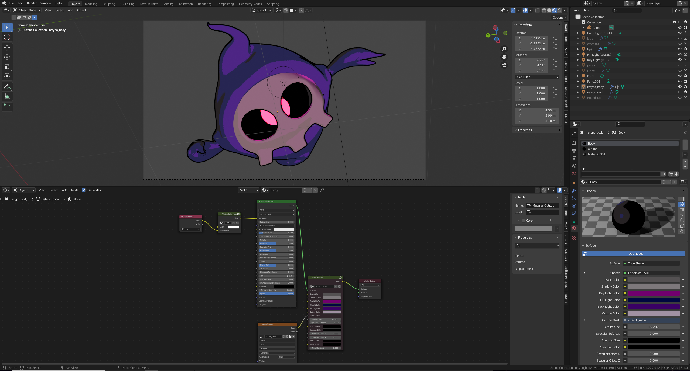
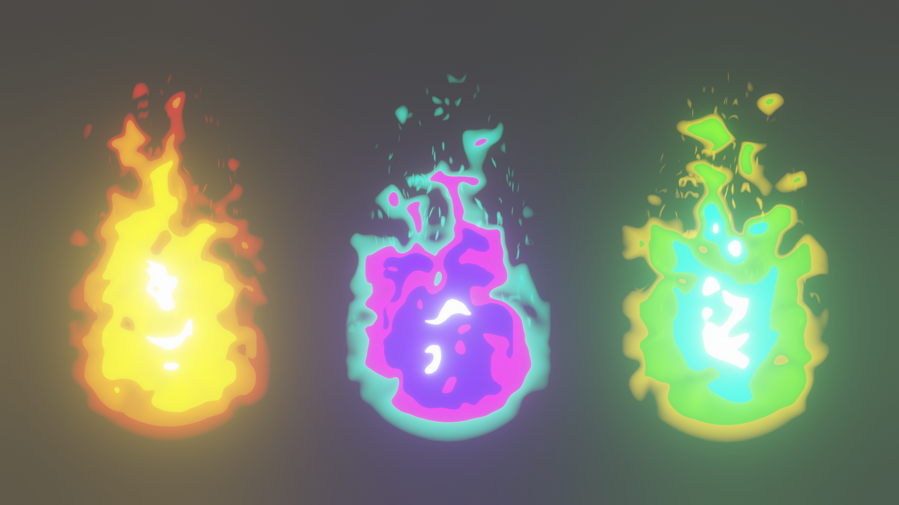
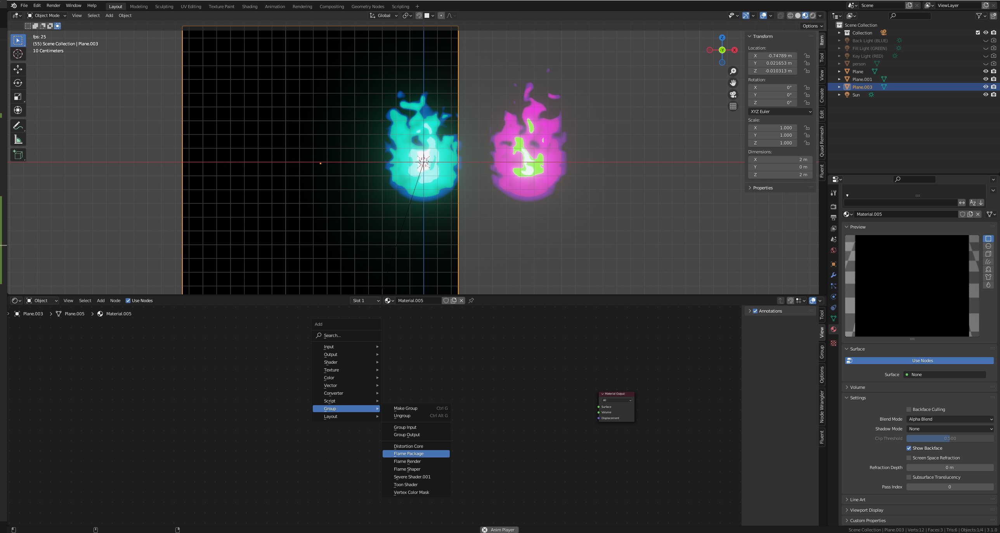
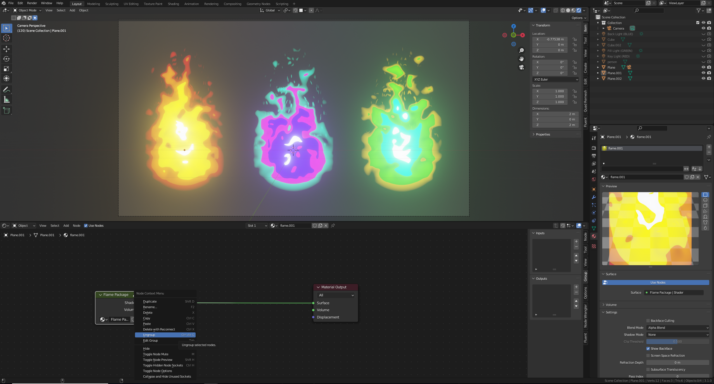
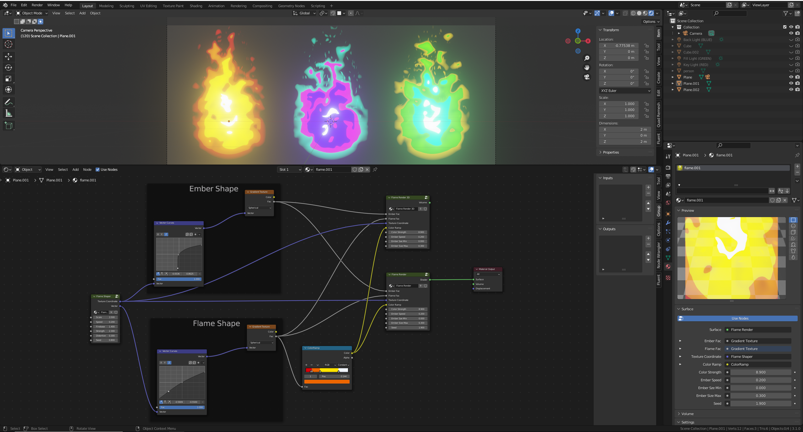
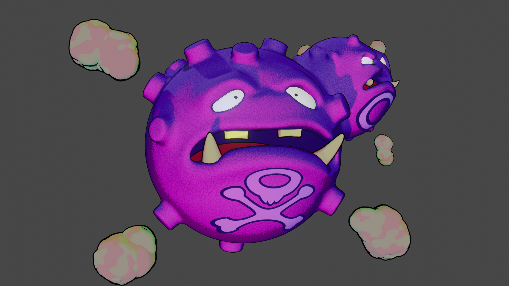
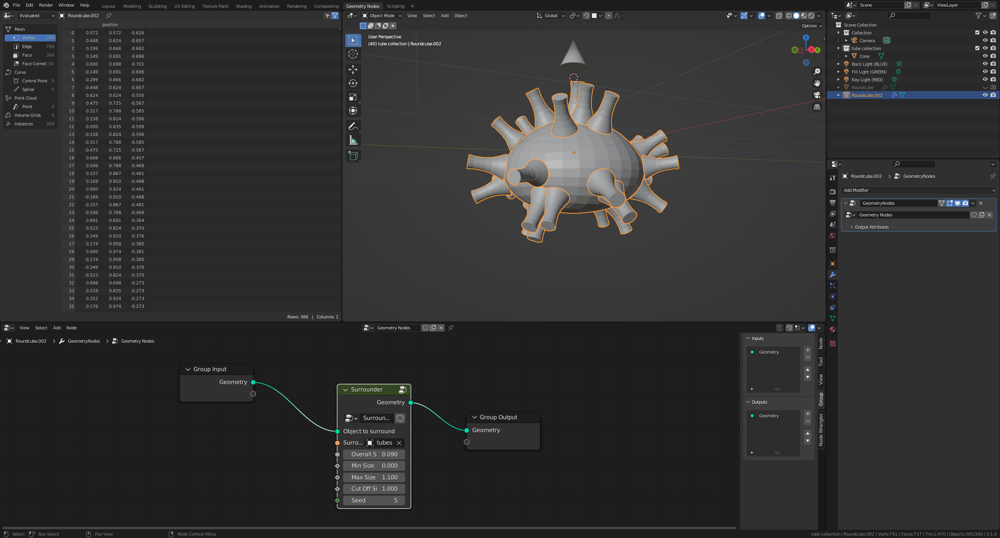
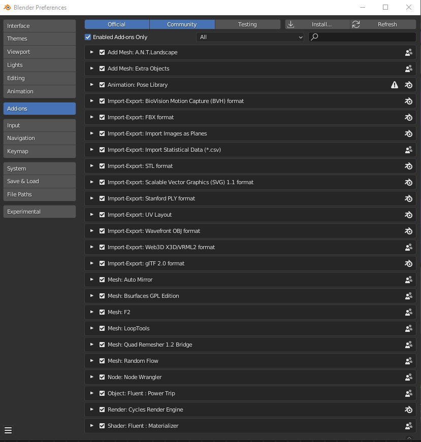

# Node Groups

What is this?

A place to serve as a singular spot for all my blender nodes. 
This includes both shader nodes and geometry nodes, so that it is easier to import them into other projects.
As well as a place to keep track of all my imports incase my computer dies lmao for any reason.

    To use a Node Group in your project:
    File > Append > Search for Exports/Shaders.blend or Exports/GeomeryNodes.blend > NodeTree

## Shaders
- Toon Shader
- Vertex Color Mask
- Flame Package

### Toon Shader And Vertex Color Mask

### Flame Package

https://www.youtube.com/watch?v=6rWAHUOywAA

In the `3D viewport`, under `Object Mode`, create a plane and rotate it 90 degrees on the `X` axis

In the `3D viewport`, under `Object Mode`, press `CTRL A` to select `Rotation & Scale`

In material `Settings` > `Blend Mode` set to `Alpha Blend`

In material `Settings` > `Shadow Mode` set to `None`

## Geometry Nodes
- Surrounder

### Surrounder

<https://www.youtube.com/watch?v=xkhq65zmx-o>

## Blender Imports

