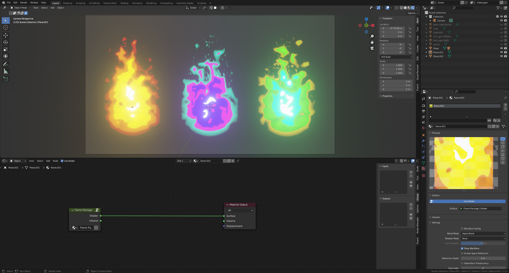
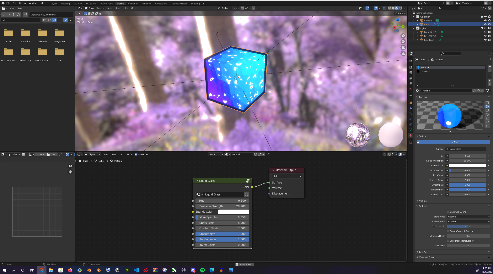

# Node Groups

What is this?

A place to serve as a singular spot for all my blender nodes. 
This includes both shader nodes and geometry nodes, so that it is easier to import them into other projects.
As well as a place to keep track of all my imports incase my computer dies lmao for any reason.

    To use a Node Group in your project:
    File > Append > Search for Exports/Shaders.blend or Exports/GeomeryNodes.blend > NodeTree

## Shaders
- Toon Shader
- Vertex Color Mask
- Flame Package
- Custom Background
- Liquid Glass

### Toon Shader And Vertex Color Mask

Make sure that the Key, Fill and Back light intensities are appropriate.
Works well with custom background world shader.

If using an outline, make sure that the primary material is first and the outline emission is second
before using solidify/.2/flip

### Flame Package

https://www.youtube.com/watch?v=12FvzJxlGHQ

https://www.youtube.com/watch?v=6rWAHUOywAA

In the `3D viewport`, under `Object Mode`, create a plane and rotate it 90 degrees on the `X` axis

In the `3D viewport`, under `Object Mode`, press `CTRL A` to select `Rotation & Scale`

In material `Settings` > `Blend Mode` set to `Alpha Blend`

In material `Settings` > `Shadow Mode` set to `None`

### Custom Background

## Liquid Glass

## Geometry Nodes
- Surrounder
- Movement

### Surrounder

<https://www.youtube.com/watch?v=xkhq65zmx-o>

### Movement

## Blender Imports

## Resources

https://www.onlineconverter.com/video-to-gif

